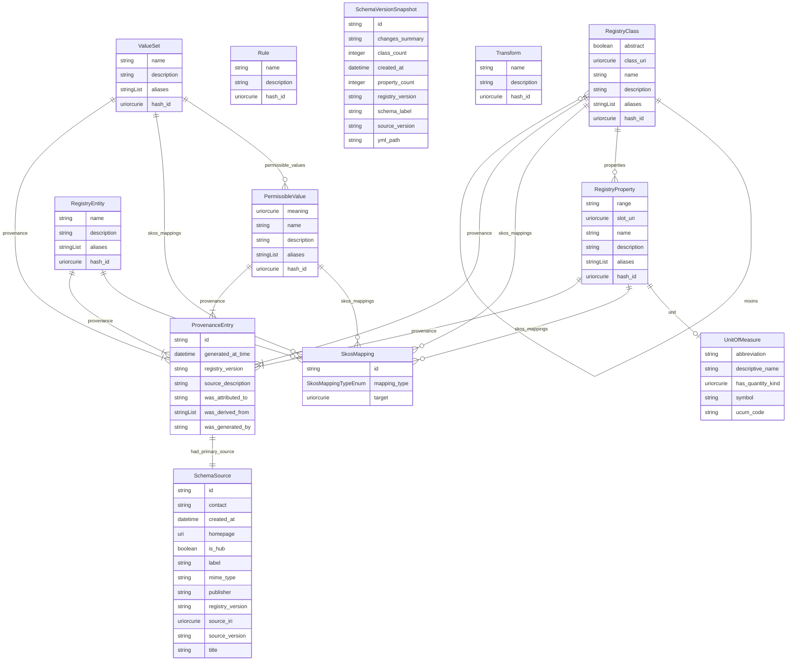

# The registry meta-model

A logical view of every class and relationship in `schemas/meta_model.yaml`
(LinkML's `gen-erdiagram`, run via `scripts/gen_erdiagram.sh`). This shows
*logical* relationships — every object-valued slot is drawn as an edge,
regardless of how it's actually stored. For the *physical* LadybugDB layout
(inline classes like `UnitOfMeasure` flattened onto their parent's own
columns, per `db.py`'s `_build_registry_ddl()`), see the "Graph Schema"
diagram in `index.html` instead, kept in sync via `scripts/update_graph.py`.

See [`ingestion.md`](ingestion.md) for the field-by-field walkthrough of
what's identity-defining vs. provenance vs. alignment evidence.

<!-- ERDIAGRAM:START (generated by scripts/gen_erdiagram.sh — do not edit by hand) -->

<!-- ERDIAGRAM:END -->
